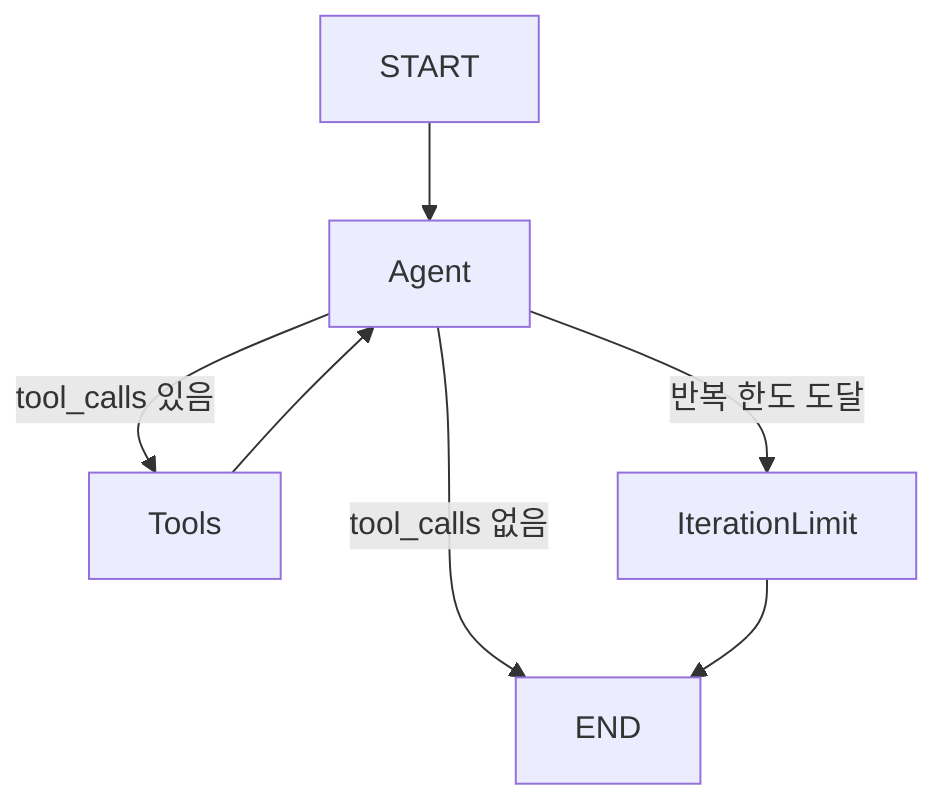

# PersonalAssistantAgent Graph

`PersonalAssistantAgent`는 Tool-calling Agent Graph다. 일반 회고 Chat 경로는
`SendMessageUseCase`에서 이 Agent로 전환되었다. `HealthChatAgent`와 `CoachingAgent`는
아직 기존 경로를 사용한다. 기존 `ChatAgent`도 cleanup 전까지 남겨둔다.



## State

- `messages`: `add_messages` reducer로 누적되는 `BaseMessage` 목록. `HumanMessage`,
  `AIMessage.tool_calls`, `ToolMessage`, 최종 `AIMessage`를 한 흐름에 보존한다.
- `mode`: `diary` 또는 `health`. System prompt 선택에만 사용한다.
- `diary_context`: diary mode의 `max_turns`, 현재 사용자 turn, `suggest_finalize` 정책.
- `llm_calls`: Tool-calling model 호출 횟수.
- `tool_rounds`: `ToolNode` 실행 횟수.

State에는 Repository, DB session, Tool 객체, 모델 객체, settings 객체를 저장하지 않는다.

## Nodes

- `agent`: mode별 `SystemMessage`를 앞에 붙여 `ToolCallingChatModel`을 호출하고,
  반환된 `AIMessage`를 그대로 messages에 추가한다.
- `tools`: LangGraph `ToolNode`에 등록된 읽기 전용 Tool을 실행한다. Tool 실행 로직을
  Agent가 직접 구현하지 않는다.
- `iteration_limit`: 추가 LLM 호출 없이 결정론적인 `AIMessage`를 반환한다.

## Conditional Edge

`agent` 실행 후 마지막 메시지가 `AIMessage`인지 확인한다.

- `tool_calls`가 없으면 종료한다.
- `tool_calls`가 있고 `tool_rounds`가 한도 미만이면 `tools`로 이동한다.
- `tool_calls`가 있지만 한도에 도달했으면 `iteration_limit`로 이동한다.

Tool 호출 여부는 `AIMessage.tool_calls`만으로 판단한다.

## Tool Loop

Agent는 요청별 실행 context가 이미 바인딩된 `BaseTool` 목록을 생성자로 받는다. 현재 단계에서
등록 가능한 Tool은 `search_diary_memories`, `search_health_records`다. `ToolNode`가
생성한 `ToolMessage`는 다음 `agent` 호출의 messages에 포함된다.

일반 Chat 실행 구조는 다음과 같다.

```text
SendMessageUseCase
    → PersonalAssistantAgentFactory
        → request-scoped read tools
        → ToolCallingChatModel
        → PersonalAssistantAgent
    → final AIMessage
    → ChatSession assistant message 저장
```

`PersonalAssistantAgentFactory`는 요청별 `device_id`와 `session_id`를
`AgentToolExecutionContext`에 바인딩해 Tool을 생성한다. `SendMessageUseCase`는
`ChatMessage`를 LangChain `BaseMessage`로 변환한 뒤 diary mode와
`DiaryConversationContext`를 전달한다. 일기 마무리 동의 판별, 강제 마무리, closing message,
일기 생성, 이벤트 청크 추출은 여전히 `SendMessageUseCase` 책임이다.

Tool 내부 예외는 `handle_tool_errors=False`로 상위에 전파한다. 현재 LangGraph `ToolNode`는
존재하지 않는 Tool 이름에 대해서는 `status="error"`인 `ToolMessage`를 생성해 다음 모델
호출로 전달한다. 본격적인 오류 분류, 사용자 친화적 오류 응답, retry는 후속 PR 범위다.

## Limits

기본 최대 Tool round는 3회다. 이 제한은 비즈니스 수준의 반복 제한이며, Graph 실행에는 보조
안전장치로 별도 recursion limit을 설정한다. 이번 PR에는 retry, timeout, checkpointer,
persistence, human-in-the-loop가 포함되지 않는다.

## Next

다음 단계에서 Health Chat 경로를 이 Agent로 전환할 수 있다.
