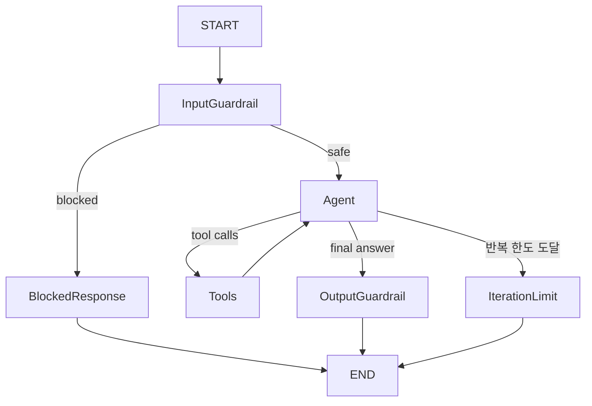

# PersonalAssistantAgent Graph

`PersonalAssistantAgent`는 Tool-calling Agent Graph다. 일반 회고 Chat, Health Chat 메시지
전송, Coaching 메시지 경로는 이 Agent로 전환되었다. 기존 legacy Agent 구현은 제거되었고,
세 운영 메시지 경로는 `PersonalAssistantAgentFactory`를 통해 Agent를 생성한다.



## State

- `messages`: `add_messages` reducer로 누적되는 `BaseMessage` 목록. `HumanMessage`,
  `AIMessage.tool_calls`, `ToolMessage`, 최종 `AIMessage`를 한 흐름에 보존한다.
- `mode`: `diary`, `health`, `coaching`. System prompt와 Tool scope 선택에 사용한다.
- `diary_context`: diary mode의 `max_turns`, 현재 사용자 turn, `suggest_finalize` 정책.
- `coaching_context`: coaching mode의 `persona` 정책.
- `llm_calls`: Tool-calling model 호출 횟수.
- `tool_rounds`: `ToolNode` 실행 횟수.
- `guardrail_verdict`: `medical_guardrail.GuardrailVerdict`. `input_guardrail`이 요청마다
  실제 판정으로 덮어쓴다.

State에는 Repository, DB session, Tool 객체, 모델 객체, settings 객체를 저장하지 않는다.

## Nodes

- `input_guardrail`: HEALTH/COACHING mode의 최신 `HumanMessage`만 `medical_guardrail`로
  분류한다. DIARY mode는 pass-through로 `SAFE` 처리한다.
- `blocked_response`: `ADVICE_BOUNDARY` 또는 `EMERGENCY` 입력에 대해 LLM과 Tool 호출 없이
  `build_disclaimer()`의 고정 면책 `AIMessage`를 반환한다.
- `agent`: mode별 `SystemMessage`를 앞에 붙여 `ToolCallingChatModel`을 호출하고,
  반환된 `AIMessage`를 messages에 추가한다. output guardrail에서 동일 메시지를 교체할 수
  있도록 provider가 id를 주지 않은 응답에는 내부 id를 부여한다.
- `tools`: LangGraph `ToolNode`에 등록된 읽기 전용 Tool을 실행한다. Tool 실행 로직을
  Agent가 직접 구현하지 않는다.
- `output_guardrail`: HEALTH/COACHING mode의 최종 `AIMessage`에 처방 용량·복용 지시
  표현이 섞였는지 `contains_prescriptive_content()`로 검사한다. 감지되면 동일 message id로
  `ADVICE_BOUNDARY` 면책 응답을 교체한다. DIARY mode는 응답을 변경하지 않는다.
- `iteration_limit`: 추가 LLM 호출 없이 결정론적인 `AIMessage`를 반환한다.

## Conditional Edge

`input_guardrail` 실행 후 `SAFE`만 `agent`로 이동한다. 그 외 판정은 `blocked_response`로
단락한다. 위험 입력에서는 `ToolCallingChatModel`, `ToolNode`, `search_health_records`,
`HealthRecordQueryService`, embedding, Repository가 호출되지 않는다.

`agent` 실행 후 마지막 메시지가 `AIMessage`인지 확인한다.

- `tool_calls`가 없으면 `output_guardrail`로 이동한 뒤 종료한다.
- `tool_calls`가 있고 `tool_rounds`가 한도 미만이면 `tools`로 이동한다.
- `tool_calls`가 있지만 한도에 도달했으면 `iteration_limit`로 이동한다.

Tool 호출 여부는 `AIMessage.tool_calls`만으로 판단한다.

## Safety Policy

의료 안전 정책은 순수 도메인 서비스 `app.domain.service.medical_guardrail`을 재사용한다.
keyword 목록, 판정 우선순위, 면책 문구를 mode별로 복사하지 않는다.

- `SAFE`: 기존 Agent 및 Tool loop로 진행한다.
- `ADVICE_BOUNDARY`: 진단, 처방, 약물, 증상 상담 요청으로 보고 고정 면책 응답을 반환한다.
- `EMERGENCY`: 응급 신호로 보고 119 또는 응급실 안내가 포함된 고정 면책 응답을 반환한다.

Health/Coaching prompt의 진단·처방 금지 문구는 모델 생성 보조 정책이다. 입력 차단과 출력
치환은 Graph Node의 결정론 정책이 담당한다.

## Tool Loop

Agent는 요청별 실행 context가 이미 바인딩된 `BaseTool` 목록을 생성자로 받는다. `ToolNode`가
생성한 `ToolMessage`는 다음 `agent` 호출의 messages에 포함되지만 Domain 대화 내역에는
저장하지 않는다.

mode별 Tool scope는 다음과 같다.

- diary: `search_diary_memories`, `search_health_records`
- health: `search_health_records`만 허용
- coaching: Tool 없음

Chat API 실행 구조는 다음과 같다.

```text
SendMessageUseCase
    → PersonalAssistantAgentFactory(mode=DIARY)
        → request-scoped read tools
        → ToolCallingChatModel
        → PersonalAssistantAgent
    → final AIMessage
    → ChatSession assistant message 저장
```

Health Chat API 메시지 전송 구조는 다음과 같다.

```text
SendHealthMessageUseCase
    → PersonalAssistantAgentFactory(mode=HEALTH)
        → request-scoped search_health_records tool
        → ToolCallingChatModel
        → PersonalAssistantAgent
    → final AIMessage
    → HealthSession assistant message 저장
```

Coaching API 메시지 전송 구조는 다음과 같다.

```text
SendCoachingMessageUseCase
    → PersonalAssistantAgentFactory(mode=COACHING)
        → empty tools
        → ToolCallingChatModel
        → PersonalAssistantAgent
    → final AIMessage
    → reply 반환
    → ExtractSignalsUseCase best-effort 실행
```

`PersonalAssistantAgentFactory`는 요청별 `device_id`와 `session_id`를
`AgentToolExecutionContext`에 바인딩해 Tool을 생성한다. `SendMessageUseCase`는
`ChatMessage`를 LangChain `BaseMessage`로 변환한 뒤 diary mode와
`DiaryConversationContext`를 전달한다. 일기 마무리 동의 판별, 강제 마무리, closing message,
일기 생성, 이벤트 청크 추출은 여전히 `SendMessageUseCase` 책임이다.

회고 세션 시작 greeting, finalize intent, closing message, 일기 생성, 이벤트 청크 추출은
`AiChatService`/`ClovaClient` 책임으로 남아 있다. 메시지 중 과거 기억 검색 여부는 더 이상
별도 yes/no 분류를 사용하지 않고 모델의 Tool Calling으로 결정한다.

`SendHealthMessageUseCase`는 `HealthMessage`를 LangChain `BaseMessage`로 변환한 뒤 health
mode로 실행한다. Health mode는 `헬시` 역할, 짧은 반말 응답, 데이터 부재 고지, 의학적 진단 및
처방/약물 변경 단정 금지 정책을 사용한다. Health Chat 세션 시작 greeting은 아직
`HealthAiService.chat(messages=[])` 경로를 사용한다.

`SendCoachingMessageUseCase`는 클라이언트 history에 현재 사용자 메시지를 한 번만 추가한 뒤
coaching mode와 `CoachingConversationContext(persona)`를 전달한다. 코칭 경로는 기존처럼
stateless이며, `session_id`가 없으면 새 UUID를 만들고, 응답 후 정성 신호 추출은 best-effort로
유지한다. 코칭 전용 CLOVA 생성 설정은 temperature 0.6, max_tokens 300이다.

HEALTH/COACHING mode의 위험 입력은 정상 assistant message로 반환되는 고정 면책 응답이다. 출력
tripwire가 동작한 경우 unsafe 모델 응답은 최종 반환값과 Domain `HealthMessage` 또는 Coaching
reply에 남지 않고, 동일 message id의 면책 `AIMessage`로 교체된다.

DIARY mode는 의료 keyword를 새로 차단하지 않는다. 회고 prompt, Tool scope, 마무리 제안,
반복 제한, 일기 생성 흐름은 기존과 동일하다.

Tool 내부 예외는 `handle_tool_errors=False`로 상위에 전파한다. 현재 LangGraph `ToolNode`는
존재하지 않는 Tool 이름에 대해서는 `status="error"`인 `ToolMessage`를 생성해 다음 모델
호출로 전달한다. 본격적인 오류 분류, 사용자 친화적 오류 응답, retry는 후속 PR 범위다.

## Timeout Policy

`PersonalAssistantAgent`에는 provider transport와 별도로 application 실행 deadline을 둔다.

- `CLOVA_AGENT_TIMEOUT_SECONDS`(기본 30초): CLOVA HTTP provider transport timeout이다.
- `PERSONAL_ASSISTANT_MODEL_CALL_TIMEOUT_SECONDS`(기본 25초): `agent` node의 model 호출 1회를
  제한한다.
- `PERSONAL_ASSISTANT_TOOL_ROUND_TIMEOUT_SECONDS`(기본 15초): `ToolNode` 실행 1회 전체를
  제한한다. 하나의 AIMessage에 여러 Tool call이 있어도 하나의 round deadline을 공유한다.
- `PERSONAL_ASSISTANT_EXECUTION_TIMEOUT_SECONDS`(기본 45초): guardrail, model, Tool loop,
  output guardrail, iteration limit을 포함한 Graph 전체 실행을 제한한다.

Model/Tool deadline이 먼저 만료되면 `PersonalAssistantTimeoutError`의 `model` 또는 `tool`
stage가 유지된다. 전체 deadline이 먼저 만료될 때만 `execution` stage가 발생한다. timeout은
retry, legacy fallback, 빈 Tool 결과, 의료 면책 응답으로 변환하지 않는다.

Diary, Health, Coaching 메시지 API는 이 예외를 동일한 HTTP 504 응답으로 변환한다. timeout
요청은 assistant message, session save, diary/chunk 후속 처리 또는 coaching signal extraction을
실행하지 않는다.

`DiaryMemoryQueryService`와 `HealthRecordQueryService`는 동기 embedding 계산만 worker thread로
offload하고 Repository 호출은 기존 async 흐름으로 유지한다. thread에서 시작된 embedding 계산은
cancellation 뒤 즉시 강제 종료할 수 없지만, 읽기 전용 Tool이므로 이번 단계에서는 결과를 기다리거나
부분 결과를 저장하지 않는다.

## Model Provider Retry

`ClovaToolCallingChatModel`은 공개 `openai`와 `httpx` 예외를 Application의
`ModelProviderError`로 변환한다. 원본 provider 예외와 API key, 요청 내용은 API 응답에 노출하지
않고 cause chaining으로만 보존한다.

- retryable: HTTP 429, 500, 502, 503, 504와 provider transport/network 오류
- non-retryable: HTTP 400, 401, 403, 404, 지원하지 않는 provider 오류, model response type 오류,
  validation 오류, cancellation

`RetryingToolCallingChatModel`은 model 호출만 감싼다. 기본값은 최초 호출을 포함해 최대 2회이며,
0.5초에서 시작해 2배씩 증가하고 최대 2초로 제한한다. jitter와 provider 내부 retry는 사용하지
않으며, CLOVA adapter의 `max_retries=0`을 유지한다.

```text
PersonalAssistantAgent model-call timeout
  -> RetryingToolCallingChatModel
     -> provider attempt 1
     -> backoff
     -> provider attempt 2
```

retry와 backoff는 새 deadline을 만들지 않고 기존 model-call timeout 안에서 실행된다. Tool,
Repository, embedding, Graph, UseCase, guardrail, validation, application timeout은 재시도하지 않는다.

retryable provider 오류가 모두 소진되면 Diary, Health, Coaching API는 HTTP 503으로 응답한다.
non-retryable provider 오류는 HTTP 502, PersonalAssistant timeout은 기존 HTTP 504를 유지한다.
어느 실패도 assistant message 저장, diary/chunk 후속 처리, coaching signal extraction을 실행하지
않는다.

## Limits

기본 최대 Tool round는 3회다. 이 제한은 비즈니스 수준의 반복 제한이며, Graph 실행에는 보조
안전장치로 별도 recursion limit을 설정한다. 이번 PR에는 retry, checkpointer, persistence,
human-in-the-loop가 포함되지 않는다.

## Next

다음 단계에서 오류 분류와 선택적 retry, LangGraph checkpointer/resume, Agent/RAG 평가 코드를
진행할 수 있다.
